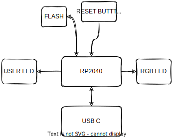
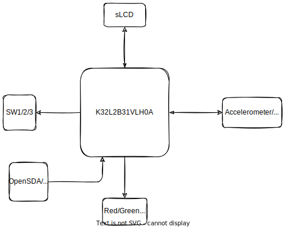

<!--
1. Investigate the board intended for your final project.
2. Investigate the board assigned to you.
For each board, look at the datasheet and getting started information for the board. Draw the
hardware block diagram for the board. For peripherals, note the communication paths (SPI, I2C,
etc).
Look through the datasheet for the processor and other documents. Answer these questions:
● What kind of processor is it?
● How much Flash and RAM does it have? Any other memory types?
● Does it have any special peripherals? (List 3-5 that you find interesting.)
● If it has an ADC, what are the features?
● How much does the board cost vs what the processor costs? Is the processor in stock
anywhere? (Try Digikey, Mouser, Octopart, Google, and so on.) 
-->

## 1. Board for final project (XIAO RP2040)

- Processor: [**RP2040**](https://datasheets.raspberrypi.com/rp2040/rp2040-datasheet.pdf) dual core MCU running at 133 MHz
- Flash: **2MB**
- RAM: **264KB**
- Peripherals(3-5):
	- PIO state machines: 8 
	- ADC: 1 ADC with 12 bit resolution
	- GPIO: 30
	- I2C: 2
	- SPI: 2
	- UART: 2
	- SSI: 1
- Cost:
	- board:**$4.60** each for 10 pieces
		- in stock: 100+ as at 2022-04-02 at [Seeed](https://www.seeedstudio.com/XIAO-RP2040-v1-0-p-5026.html)
	- processor(QFN-56 package):  **$1.29** 
		- in stock: 6000+ as at 2022-03-31 at Mouser

## 2. Board assigned to me (FRDM-K32L2B3)

- Processor: [**K32L2B31VLH0A**](https://www.nxp.com/docs/en/data-sheet/K32L2B3x.pdf) MCU running at up to 48 MHz
- Flash: **256 kB**
- RAM: **32 kB SRAM**
- Peripherals(3-5):
	-	[FlexIO module](https://community.nxp.com/t5/Kinetis-Microcontrollers/Understanding-FlexIO/ta-p/1115419): 1
	- ADC: 1 ADC with 16 bit resolution
	- DAC: 1 DAC with 12 bit resolution, 1 DAC with 6 bits resolution
	- GPIO: 50
	- LPUART: 2
	- I2C : 2
	- SPI: 2
	- UART: 1
- Cost:
	- board: **$28.27** for each unit
		- in stock: 21 at Mouser as at 2022-03-31
	- processor(LQFP64 package): **$1.64** each for 10K pieces with 52 weeks lead time
		- in stock: 6 at Mouser as at 2022-03-31