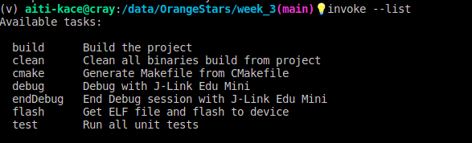
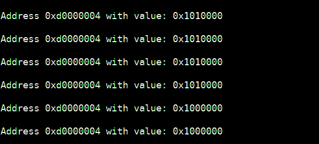

<!-- On your final project board, make blinky for yourself. Then add a button to turn the LED on and
off. Bonus points for making the button cause an interrupt. Triple bonus points for debouncing
the button signal.
What build environment are you using? You have many free options: STM32CubeMxIDE,
VSCode with Platformio, Platformio, Keil (free version), Arm GNU tools, and so on. 
For many of these, there are examples, explore these examples and re-use HALs and code as you can.
Can you step through the code to see what each line does?

Investigate further, using the processor manual:
● What are the hardware registers that cause the LED to turn on and off? (From the processor manual, don’t worry about initialization.)
● What are the registers that you read in order to find out the state of the button?
● Can you read the register directly and see the button change in a debugger or by printing out the value of the memory at the register’s address? -->

# Week 3 Exercise
I used a Raspberry Pi Pico with the RP2040 MCU for this assignment.

## Blinky

```C
#include "pico/stdlib.h"
#include "hardware/gpio.h"


const uint8_t LED = 25U;     // LED connected to GPIO 25


int main() 
{
    stdio_init_all();

    gpio_init(LED);

    gpio_set_dir(LED,true);


    while(1)
    {
		gpio_put(LED,true);
		sleep_ms(30);
		gpio_put(LED,false);
		sleep_ms(400); 
    }
    return 0;
}

```

## Blinky with button and interrupt
```C
#include "hardware/gpio.h"
#include "hardware/uart.h"


void toggle();

volatile bool on = false;

const uint8_t btn = 16U;    // button connected to GPIO 16
const uint8_t LED = 25U;     // LED connected to GPIO 25const 


int main() 
{
    stdio_init_all();

    gpio_init(LED);
    gpio_init(btn);

    gpio_set_dir(LED,true);
    gpio_set_dir(btn,false);
    gpio_set_pulls(btn,true,false);     //enable pull up on btn pin

    gpio_set_irq_enabled_with_callback(btn,GPIO_IRQ_LEVEL_LOW,true,&toggle);    //setup interrupt on specified GPIO

    while(1)
    {

    if(on)
    {
        gpio_put(LED,true);
        sleep_ms(30);
        gpio_put(LED,false);
        sleep_ms(400); 
    }
 
    }
    return 0;
}


void toggle()
{
    on = !on;

}
```


<!-- ## Blinky with button debounce
```C

``` -->


## Build environment
- Text editor: VSCode
- Compiler: GNU Arm Embedded Toolchain
- SDK: Raspberry Pi Pico SDK
- Programmer : JLink Edu Mini over SWD

I use [Invoke](https://docs.pyinvoke.org/en/0.11.1/api/cli.html) (a python tool) for tying all together in `tasks.py` to setup the commands and call them by simple names.
To setup the project, I created a shell script called `setup.sh` to setup the directory with Invoke and the directory structure.
To use the Invoke tool, `virtualenv` is called to create a virutal environment for Invoke to run.
The list of invoke commands(tasks) I have created is as follows:


 

## Hardware Registers
Each GPIO has a status register and a control register
### Registers that cause the LED to turn ON and OFF:
- `GPIO_OUT`(mapped to `0xd000000 | 0x010`) is what I see in the datasheet but I can't seem to see it change value when I print its content. (I'm working on inspecting that register's content with the JLink Debugger).
### Register read to find out value on button GPIO pin:
- `GPIO_IN` (which is mapped to `0xd0000000 | 0x004`)reports the value seen on all GPIO pins, masking can then be used to single out a specific bit from (0 - 29)
- Bit 16 is the bit of interest since that's the pin the button is connected to.
- I was able to see this register change value on button press.


## Debugging
- Stepping through code: JLinkGDBServer runs and listens on port 2331 on localhost
- I connect to it using arm-none-eabi-gdb:
	- `target remote localhost:2331`
- set breakpoint `b #lineNumber`
- step `step`
- inspect registers `info registers`
