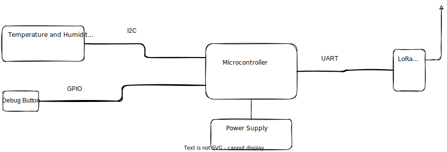
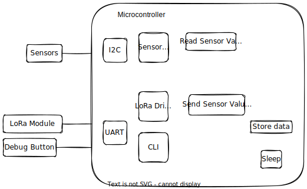
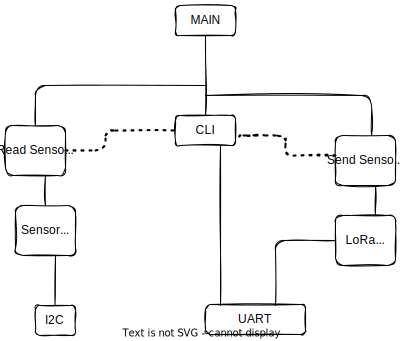

# Application description
## Bush Fire Detection
Bush fires can be expensive to contain when the weather fans combustion. The extent of the damage can be limited when the fires are detected early and attended to.

The bush fire detection system detects precursors to a fire. Variations in values of ambient parameters like: **temperature**, **humidity**,**C0 gas**, **C02 gas** in an area can help detect forest fires as early as posible.
The data is collated from different nodes and the decision is made to raise a fire alarm or not. When a fire alarm is raised by the system, the fire service can be deployed to check it out and forestall the spread of the fire.

This project measures two of the above mentioned parameters and transmits them over a long range communication technology to a gateway.
The long range communication technology being considered is LoRa.

The system has edge devices that gather ambient data and a gateway that collates them for deciding if there is a potential fire.

## Project Scope
The previous section describes a more elaborate version of the Bush fire detection system. For this course, my aim was to develop the edge node and a gateway with more focus on the edge node.
The edge node gathers temperature and humidity data and sends them over LoRa to the gateway in  a peer-to-peer fashion.
The data is then saved to a text file on the gateway.

# Hardware description
The hardware setup of the system consists of two main parts:
1. The Edge node and
2. The Gateway

### Edge node:
The Edge node is the part of the system that collects the data in the forest. It is made of:
- Microcontroller
- Sensor:
	- Temperature and Humidity sensor
- Button
- LoRa transciever
- Power supply

### Gateway:
The Gateway is a central station to which the edge nodes send the data gathered. It is made of:
- LoRa transciever
- SBC

## Hardware Parts Requirements
### Edge node

#### Microcontroller
- Available
- Cortex M series based
- Low power 
#### Sensor
- Cheap
- Wide temperature range
- 

#### LoRa transciever
- Frequency
- Availability
- Low cost
- Low power

#### Power Supply
- 
### Gateway:
#### LoRa transciever
- 
#### SBC
- Low cost
- Fairly powerful
- Available

## Hardware Selection
- Edge node:
	- Microcontroller: 
		- RP2040( Arm Cortex-M0+)
			- 264KB internal RAM
			- 2MB external flash
		
	- Sensor: 
		- AHT21 temperature and humidity sensor
	- LoRa transciver: 
		- RAK4200 breakout board with antenna
	- Power supply:

# Software description
<!-- - Describe code in general -->
There are two main code repositories. One for the Edge node and one for the Gateway. However, most of the concentration is on the edge device.

### Code written
<!-- - Describe parts you wrote in some detail(3-5 sentences per module) -->
<!-- I wrote the AHT21 driver guided by vendor code. -->
I wrote the code to gather the sensor data, store it and transmit at intervals. I also wrote code to put the device to sleep and wake at predetermined intervals.
I implemented a state machine to cycle through various states in the life of the edge device.
The state machine table is described [here](https://github.com/raynayx/OrangeStars/blob/main/week_4/README.md).

<!-- - Describe code you re-used from other sources, including licenses for those -->
### Code Reuse
I used a library from the vendor of the LoRa module (RAK Wireless).
I also used the Raspberry Pi Pico SDK.

# Diagram of the system architecture
## System Block diagram

## Hardware Block diagram of Edge node

## Software Block diagram of Edge node

## Software Hierarchy of Control diagram

## Software Layered Block diagram

# Build instructions
## How to build the system(including toolchain)
### Hardware
- Connect the AHT21(temperature sensor) to the RP2040 board over the I2C pins
- Connect the RAK4270(LoRa module) to the RP2040 board over UART pins
- Connect the external antenna to the RAK4270 board
### Software
#### Setting up tool chain
I setup the GCC embedded toolchain for ARM by doing [this](./armEmbedded.md).
I setup the Raspberry Pi Pico SDK on Fedora 35 mostly using instruction from the SDK's manual. I wrote a short Invoke(python based) script to make calling the other commands cleaner and easier.
I have a couple of `sh` scripts to make setting up the project. These are on my [repo](https://github.com/raynayx/setupScripts) as sample bare project.

### How you debugged and tested the system
I used a J-Link Edu Mini as the debugger over SWD connected to the Raspberry Pi Pico. I then connected using GDB and was able to step through code as needed.
In order to test the LoRa module, I used RAK's Serial program to receive commands sent from the edge node to confirm it was working. To trigger the debug mode on the edge node, the button connected to the edge node causes an interrupt which is handled by switching the device into debug mode where the CLI is available.
### How you powered it (and how you might in the future)

# Future
- What would be needed to get this project ready for production?
- How would you extend this project to do something more?
	- Are there other features you'd like to add?
		- How would you go about adding them?
# Grading
- Self assessment of the project: 
- Have you gone beyond the basic requirement? How so?

# Link to the code

# Project To-Dos
- [ ] Setup environment
	- [ ] Push sample setup project and add link
	- [ ] Setup simple unit tests
- [ ] Edge node code
	- [ ] Sensor data gathering code
	- [ ] Data transmission code
	- [ ] Data storage code
	- [ ] Implement state machine
- [ ] Hardware assembly for edge node
	- [ ] Connect sensor to MCU
	- [ ] Connect LoRa module to MCU
	- [ ] 
- [ ] Hardware assembly for Gateway
	- [ ] Connect LoRa module to Raspberry Pi
	- [ ] Retrieve data and store in a text file
- [ ] Gateway code	

# References
[RAK vendor code repo](https://github.com/RAKWireless/Products_practice_based_on_RUI_v2.0)
[Weather impact on forest fires](https://wxguys.ssec.wisc.edu/2016/05/09/wx-forest-fires/#:~:text=Weather%20and%20climate%20are%20important,start%20and%20spread%20a%20fire.)
[Wildfires and Climate change](https://www.c2es.org/content/wildfires-and-climate-change/)