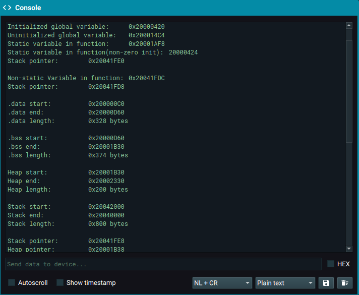

# RP2040 Memory Layout

According to the RP2040 datasheet,
- Flash starts at 0x10000000
- SRAM (divided into 6 banks for improved parallelism) starts at 0x20000000

## Default Linker script memory layout

As seen in the image,
- The initialized gobal variable is placed in SRAM, in the data

- The uninitialized global goes into SRAM in the .bss section

- The static variable in the function goes to a location just before .bss

- The .data section starts at the lowest SRAM address

- Non-static variable in a function goes onto the stack

- The Heap begins right after the .bss section in SRAM

- The Stack is setup at the highest memory location in SRAM and grows towards the lower memory locations.

- The Stack pointer holds the address of the top of the stack. This address changes depending on the contents on the stack.
In the screenshot, 3 different address for the stack pointer are shown since I checked in `main` and two other functions.

# Linker script
The default linker script is located at `$PICO_SDK_HOME/src/rp2_common/pico_standard_link/memmap_default.ld`. 
- The file is commited with the same name.
- The modified linker script is commited as `memmap_mod.ld`
<!-- In CMakeLists.txt, `` the directive for a linker script other than the default is given. -->

# Map file
The sections and variables shown in the image match the map file's report.
- The map file produced with the default linker script has been commited as `firmware.elf.map`.
<!-- - The map file produced with the modified linker script has been commited as `firmware_mod.elf.map`. -->
